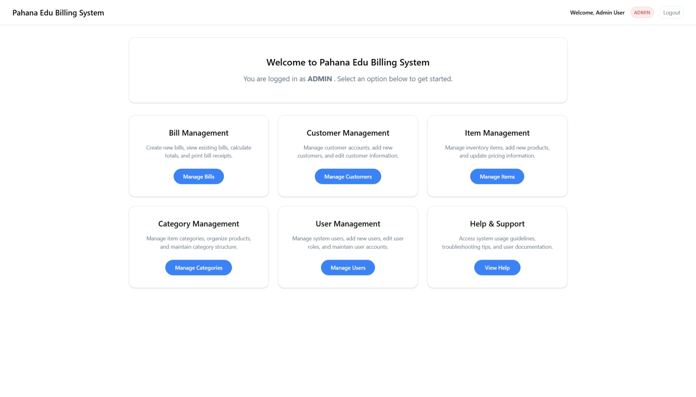

# Pahana Edu Billing System

> This project is part of the assignment for the Advanced Programming module in the BSc (Hons) Software Engineering program.



## Overview

Pahana Edu Billing System is a comprehensive Java-based web application designed for the Pahana Edu bookshop in Sri Lanka. It features complete billing management, user management with role-based access control, customer management, inventory management, and comprehensive reporting. Built with Jakarta EE Servlets (6.0), JSP, and MySQL, it demonstrates enterprise-level layered architecture with session-based authentication, multi-role authorization, and modern design patterns, including the Builder pattern for clean object construction.

## Key Features

- **Complete Billing System**: Dynamic bill creation with real-time calculations, multiple payment methods (Cash, Credit Card, Debit Card, Bank Transfer), and print-ready receipts
- **Advanced User Management**: Admin-controlled user accounts with role-based permissions (Admin/Cashier), email validation, and comprehensive security
- **Customer Management**: Comprehensive customer profiles with auto-generated 6-digit account numbers (ZEROFILL format) and relationship tracking
- **Inventory Management**: Category-based item organization with pricing management
- **Role-Based Security**: Differentiated access levels (Admin: full system access, Cashier: operational restrictions) with server-side and UI enforcement
- **Modern Design Patterns**: Builder pattern implementation for clean object construction, enhanced readability, and maintainable test data creation
- **Comprehensive Testing**: 100+ JUnit 5 test cases covering models, DAOs, enums, utilities, and Builder pattern functionality with database integration testing
- **Help System**: Context-sensitive documentation with role-based content and troubleshooting guides
- **Audit Compliance**: Soft deletes and referential integrity for financial record keeping

## Project Structure

The project follows the Maven standard layout, with additional organization for MVC and DAO patterns:

```text
Pahana Edu Billing System/
├── pom.xml
├── src/
│   └── main/
│       ├── java/
│       │   └── com/pahanaedu/
│       │       ├── controller/         # Servlets (LoginServlet, UserServlet, BillServlet, etc.)
│       │       ├── dao/                # Data Access Objects (UserDAO, BillDAO, CustomerDAO, etc.)
│       │       ├── service/            # Business logic (AuthService)
│       │       ├── filter/             # Servlet filters (AuthenticationFilter)
│       │       ├── helpers/            # Utility classes (DatabaseHelper)
│       │       ├── model/              # Data models/POJOs (User, Bill, Customer, Item, etc.)
│       │       ├── enums/              # Enumerations (UserRole, PaymentMethod, PaymentStatus)
│       │       └── util/               # Utilities (PasswordUtil)
│       ├── resources/
│       │   ├── db.properties.example   # Example properties file (copy to db.properties and fill in credentials)
│       │   └── db.properties           # (NOT in version control; required for DB connection)
│       └── webapp/
│           ├── index.jsp               # Landing page
│           ├── login.jsp               # Login form
│           ├── dashboard.jsp           # Main dashboard with role-based navigation
│           ├── users.jsp               # User management (admin only)
│           ├── user-form.jsp           # User create/edit form
│           ├── customers.jsp           # Customer management
│           ├── customer-form.jsp       # Customer create/edit form
│           ├── items.jsp               # Item management (role-based access)
│           ├── item-form.jsp           # Item create/edit form
│           ├── categories.jsp          # Category management (role-based access)
│           ├── category-form.jsp       # Category create/edit form
│           ├── bills.jsp               # Bill management
│           ├── bill-form.jsp           # Bill create/edit with dynamic items
│           ├── bill-view.jsp           # Bill viewing and printing
│           ├── help.jsp                # Comprehensive user guide with role-based content
│           ├── account-details.jsp     # User account management
│           ├── css/                    # Modernized CSS with minimal override pattern
│           │   ├── common.css          # Shared styles (75% of all CSS)
│           │   ├── login.css           # Login page styles
│           │   ├── dashboard.css       # Dashboard styles
│           │   └── [module].css        # Module-specific overrides only
│           ├── js/                     # JavaScript with app object architecture
│           │   ├── common.js           # Shared utilities (app object)
│           │   └── [module].js         # Module-specific logic using app utilities
│           └── WEB-INF/
│               └── web.xml             # Deployment descriptor
├── test/
│   └── java/com/pahanaedu/             # Comprehensive test suite (100+ tests)
│       ├── model/                      # Model testing (6 test classes)
│       ├── dao/                        # DAO testing (6 test classes)
│       ├── enums/                      # Enum testing (1 test class)
│       └── util/                       # Utility testing (1 test class)
├── database/
│   ├── schema.sql                      # Database schema with foreign keys
│   └── seeds.sql                       # Sample data for testing
└── target/
    ├── PahanaEdu.war                   # Deployable WAR file
    └── test-results/                   # Test execution reports
```

## Key Files

- **Controllers**: `UserServlet.java`, `BillServlet.java`, `CustomerServlet.java`, `ItemServlet.java`, `CategoryServlet.java` - Complete CRUD operations with role-based permissions
- **Authentication**: `LoginServlet.java`, `LogoutServlet.java`, `AuthenticationFilter.java` - Session-based security with comprehensive access control
- **Data Access**: `UserDAO.java`, `BillDAO.java`, `CustomerDAO.java`, etc. - Standardized DAO pattern with BaseDAO and comprehensive testing
- **Business Logic**: `AuthService.java` - Authentication and authorization logic with role-based validation
- **Models**: `User.java`, `Bill.java`, `Customer.java`, `Item.java`, `Category.java` - Complete data models with business logic and calculations
- **Enums**: `UserRole.java`, `PaymentMethod.java`, `PaymentStatus.java` - Type-safe enumerations with CSS integration and validation
- **Database**: `DatabaseHelper.java` - Singleton DB connection manager with properties-based configuration
- **Security**: `PasswordUtil.java` - Password handling utilities
- **Frontend**: Role-based JSP pages with unified CSS/JS architecture, minimal override pattern, and permission controls
- **Testing**: Comprehensive JUnit 5 test suite with 100+ test cases covering models, DAOs, enums, and utilities

## User Roles & Permissions

### Administrator (ADMIN)

- **User Management**: Create, edit, and delete user accounts and assign roles
- **Full Inventory Control**: Manage categories, items, and pricing
- **Complete Bill Management**: All billing operations including deletion
- **Customer Management**: Full customer account management
- **System Configuration**: Access to all system features and settings

### Cashier (CASHIER)

- **Billing Operations**: Create, edit bills, and process payments (cannot delete bills)
- **Customer Service**: Add and edit customer information
- **Inventory Viewing**: Read-only access to items and categories
- **Limited Access**: Cannot manage users, modify pricing, or delete financial records

## Default Test Accounts

```text
Admin Account:
Email: admin@pahanaedu.com
Password: admin123

Cashier Account:
Email: cashier@pahanaedu.com
Password: cashier123
```

## Prerequisites

- **Java Development Kit (JDK)**: 17 or higher (tested with OpenJDK 24)
- **Apache Maven**: 3.6+ for dependency management and build automation
- **MySQL Server**: 8.0+ with InnoDB engine for optimal performance
- **Apache Tomcat**: 11.0.9+ (Jakarta EE 10 compatible) for servlet container
- **Development Environment**: VS Code with Java extensions, IntelliJ IDEA, or Eclipse IDE

## Build and Deployment

### 1. Environment Setup (REQUIRED)

- Copy `src/main/resources/db.properties.example` to `src/main/resources/db.properties` and fill in your MySQL credentials:

  ```properties
  db.url=jdbc:mysql://localhost:3306/pahana_edu
  db.user=your_username
  db.password=your_password
  ```

### 2. Database Setup

- Create the database and tables:

  ```sql
  CREATE DATABASE pahana_edu;
  ```

- Load schema and seed data:

  ```bash
  mysql -u [username] -p pahana_edu < database/schema.sql
  mysql -u [username] -p pahana_edu < database/seeds.sql
  ```

### 3. Build the Project

- Always run clean before package:

  ```bash
  mvn clean package
  ```

- Output: `target/PahanaEdu.war`

### 4. Deploy to Tomcat

- Copy `target/PahanaEdu.war` to Tomcat's `webapps/` directory
- Start Tomcat server
- Application will be available at:
  - `http://localhost:8080/PahanaEdu/` (WAR deployment)
  - or `http://localhost:8080/PahanaEdu_war_exploded/` (IDE exploded deployment)

## Environment Variable Setup

**IMPORTANT:** The `db.properties` file must be placed in `src/main/resources/db.properties` (not the project root). This is required for the application to start and connect to the database.

An example file is provided as `src/main/resources/db.properties.example`. Copy it to `db.properties` and fill in your credentials. The `db.properties` file is excluded from version control.

## System Architecture

The system follows a **Layered Architecture** pattern, organizing components into distinct layers with specific responsibilities:

### Architecture Layers

1. **Presentation Layer**: JSP pages, CSS, and JavaScript for user interface and interaction
2. **Business Layer**: Jakarta Servlets (controllers) and Service classes for application logic and business rules
3. **Persistence Layer**: DAO classes implementing data access patterns for database operations
4. **Database Layer**: MySQL database server for data storage and integrity enforcement

### Design Patterns Implementation

- **Model-View-Controller (MVC)**: Clean separation between data models, user interface, and control logic
- **Data Access Object (DAO)**: Abstract database interactions with standardized CRUD operations
- **Builder Pattern**: Implemented in the Bill class for clean object construction and enhanced test data creation
- **Singleton Pattern**: Database connection management through DatabaseHelper
- **Service Layer Pattern**: Business logic encapsulation in AuthService and other service classes
- **Filter Pattern**: Centralized authentication and authorization through AuthenticationFilter

### Security Model

- **Session-Based Authentication**: Secure login/logout with session management
- **Role-Based Authorization**: Permissions based on user roles
- **Route Protection**: All pages except login require authentication
- **Input Validation**: Form-based security with server-side validation
- **Data Integrity**: Soft deletes maintain referential integrity for audit compliance

### Database Design

- **Normalized Schema**: Proper relationships with foreign key constraints
- **Audit Trail**: Created/updated timestamps on all entities
- **Soft Deletes**: Logical deletion preserves historical data
- **Account System**: Auto-generated customer account numbers with zero-padding
- **Type Safety**: Enum-based status and method fields

### Frontend Architecture

- **Responsive Design**: Mobile-friendly interface with modern CSS
- **Role-Based UI**: Dynamic content and controls based on user permissions
- **Component Reuse**: Centralized CSS and JavaScript with minimal duplication
- **Form Validation**: Multi-layer validation (client-side and server-side)
- **Print Support**: Dedicated print views for bills and reports

## Testing & Quality Assurance

### Comprehensive Test Suite

The project includes a comprehensive JUnit 5 testing framework with 100+ test cases ensuring code quality and reliability:

### Running Tests

```bash
# Run all tests
mvn test

# Run tests with detailed output
mvn test -Dtest="*Test"

# Run specific test class
mvn test -Dtest="UserTest"

# Generate test reports
mvn surefire-report:report
```

### Test Coverage

- **Unit Tests**: All model classes and enums with comprehensive property testing
- **Integration Tests**: DAO classes with real database operations
- **Business Logic Tests**: Complex calculations and relationship validations
- **Edge Case Testing**: Null values, empty strings, and boundary conditions

## Troubleshooting

### Deployment Issues

- **404 on deployment:** Check the context path. In IDEs, it may deploy as `/PahanaEdu_war_exploded/`.
- **Database connection failed:** Ensure MySQL is running and `db.properties` is present in `src/main/resources/`.
- **Session timeout:** Default is 30 minutes (see `web.xml`).
- **Maven not found:** Install Maven separately (no wrapper provided).
- **Java version mismatch:** Use JDK 17+ for Jakarta EE 10 compatibility.

### Application Issues

- **Permission denied errors:** Check user role - some features require admin access.
- **Cannot delete categories/items:** Remove dependencies first or contact the administrator.
- **Login issues:** Verify credentials against database seed data or create a new admin user.
- **Bill calculation errors:** Check item prices and quantities for valid BigDecimal values.

### Testing Issues

- **Test failures:** Ensure MySQL test database is running and accessible.
- **Connection timeouts:** Check database configuration in the test environment.
- **Test data conflicts:** Tests create and clean up their data - no manual cleanup needed.
- **Maven test execution:** Use `mvn clean test` to ensure a fresh test environment.

### Development Environment

- **IDE not recognizing changes:** Run `mvn clean compile` to refresh the build.
- **CSS/JS not updating:** Clear browser cache and restart the application server.
- **Database schema mismatch:** Re-run schema.sql and seeds.sql scripts.
- **Port conflicts:** Check if ports 8080 (Tomcat) and 3306 (MySQL) are available.

## License

MIT License
